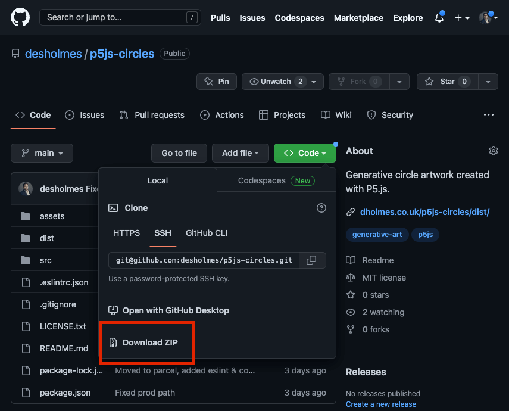

# P5.js Boilerplate (Circles)

This repo is a boilerplate for creative coding using the [P5.js](https://p5js.org/). A hosted version can be [seen here](https://dholmes.co.uk/p5js-circles/dist/).

This project uses:

1. [p5.js](https://p5js.org/): JavaScript library for creative coding
2. [dat.GUI](https://github.com/dataarts/dat.gui): Variable tinkering
3. [parcel](https://parceljs.org/): Build tooling

## Getting Started

### Prerequisites

1. Installation of [git SCM](https://git-scm.com/downloads)
1. Installation of [node.js v18.12.1](https://nodejs.org/en/)

### Create Your GitHub Repo

1. Complete the 'Getting Started > Prerequisites' section
2. [Create your GitHub Repo](https://docs.github.com/en/get-started/quickstart/create-a-repo)
3. [Download this repo as a zip](https://github.com/desholmes/p5js-circles), [initialise and push](https://training.github.com/downloads/github-git-cheat-sheet/): 
4. Follow the 'Getting Started > Development' section to start creating

### Development

1. Complete the 'Getting Started > Create Your GitHub Repo' section
2. `npm i`: To install the dependencies
3. `npm start`: To start a local dev server
4. Visit [http://localhost:1234](http://localhost:1234/) in a browser
5. Press `CTRL+c`: To stop the local dev server

### Production Build

1. Complete the 'Getting Started > Development' section
2. `npm run build`: Builds a production build to `./dist`
3. Publish your repo on [GitHub pages](https://docs.github.com/en/pages/getting-started-with-github-pages/creating-a-github-pages-site)

## Commands

|Command|Description|
|---|---|
|`npm run clean`|Cleans the [./dist](./dist) directory|
|`npm run build`|Runs `npm run clean` and `parcel build`|
|`npm run lint`|Runs [ESLint](https://eslint.org/) with 0 warnings argument|
|`npm run lint-fix`|Runs [ESLint](https://eslint.org/) with 0 warnings and `--fix` arguments|
|`npm run prettier`|Runs [Prettier](https://prettier.io/) with `--check` argument|
|`npm run prettier-fix`|Runs [Prettier](https://prettier.io/) with `--write` argument|
|`npm start`|Runs a local development server using the [parcel](https://parceljs.org/)|

## Credits

* [codetocloth reddit post](https://www.reddit.com/r/generative/comments/gc2r54/first_four_cap_designs_generated_every_design/) for the inspiration
* [Des Holmes: Technical Leadership & Product Development](https://dholmes.co.uk/) for creating [desholmes/p5js-circles](https://github.com/desholmes/p5js-circles)
  * [Blog](https://dholmes.co.uk/)
  * [Turn Gloomy January into Genuary with Generative Art](https://dholmes.co.uk/blog/genuary-p5js-boilerplate/)
  * **Skills & knowledge**: [Technical Leadership](https://dholmes.co.uk/tags/technical-leadership/), [Technical Direction](https://dholmes.co.uk/tags/technical-direction/), [Technical Delivery](https://dholmes.co.uk/tags/technical-delivery/), [Product Development](https://dholmes.co.uk/tags/product-development/), [SaaS](https://dholmes.co.uk/tags/saas/), [DevOps](https://dholmes.co.uk/tags/devops/), [Azure Public Cloud](https://dholmes.co.uk/skills/)
  * **Job Titles**: [CTO](https://dholmes.co.uk/tags/cto/), [VP Engineering](https://dholmes.co.uk/tags/vp-engineering/), [Head of DevOps](https://dholmes.co.uk/tags/devops/), [Technical Product Owner](https://dholmes.co.uk/tags/technical-product-owner/)
  * **Example Projects**: [Development standards](https://dholmes.co.uk/tags/code-quality/), [DevOps](https://dholmes.co.uk/tags/devops/), [CI/CD](https://dholmes.co.uk/tags/ci-cd/), [React](https://dholmes.co.uk/tags/react/), [docker](https://dholmes.co.uk/tags/docker/), [Cost Management](https://dholmes.co.uk/tags/costs/)